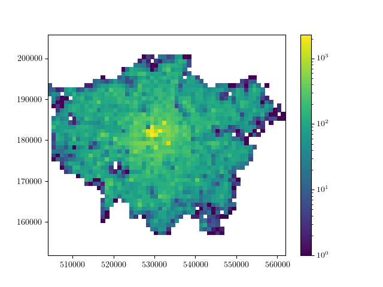

# Flood Risk Prediction tool

## Deadlines
-  *code 12pm GMT Friday 25th November 2022*
-  *presentation/ one page report 4pm GMT Friday 25th November 2022*

### Key Requirements

Your project must provide the following:

 - at least one analysis method to estimate a number of properties for unlabelled postcodes extrapolated from sample data which is provided to you:
    - Flood risk (on a 10 point scale).
    - Median house price.
 - at least one analysis method to estimate the Local Authority & flood risk of arbitrary locations. 
 - a method to find the rainfall and water level near a given postcode from provided rainfall, river and tide level data, or by looking online.

 You should also provide visualization and analysis tools for the postcode, rainfall, river & tide data provided to you, ideally in a way which will identify potential areas at immediate risk of flooding.
 
 Your code should have installation instructions and basic documentation, either as docstrings for functions & class methods, a full manual or both.




This README file *should be updated* over the course of your group's work to represent the scope and abilities of your project.

### Assessment

 - your code will be assessed for its speed (both at training and prediction) & accuracy.
 - Your code should include tests of its functionality.
 - Additional marks will be awarded for high code quality and a clean, well organised repository.

 ### Installation Guide

To install material, run:

```
git clone https://github.com/ese-msc-2022/ads-deluge-Trent.git
```

To build environment, run:

```
conda env create -f environment.yml
conda activate deluge
```

### User instructions

Our model contains the following .py documents, 

#### Risk Tool

         - tool.py ()
         
         - geo.py (Convertions. Converting between degrees and radians, between input latitude/longitude and 
           Cartesian (x, y, z) coordinates, or between OSGB36 easting/northing and GPS latitude and longitude pairs)
           
         - gridsearch.py
         
         - live.py (gets the live station data from the website)
         
         - transformer.py
         
#### Visualization
             
             - analysis.py (plots the postcode density, risk map and heatmap)
             - mapping.py (plots circles on the map)

### Risk tool

Usage:
```
tool = flood_tool.Tool()
tool.train()
tool.get_xxx_method()
```

 - Initialization - load data, preprocess by dropping duplicates and spliting into train and test sets, set default sub-models for different tasks.

 - Model training - process data, train different models (do grid search, try different hyperparameters to find the best model).

 - Make predictions - use "get_xxx_method()" and "get_xxx_estimate()" functions to predict flood risk classification labels, median house prices, and authorities.

### Live Data

Usage:
```
import flood_tool.live as live

live.get_station_data_from_csv(filename='flood_tool/resources/wet_day.csv',station_reference='2841TH')
live.get_live_station_data(station_reference='2841TH')
live.get_all_livedata()
```
 - get_station_data_from_csv() & get_live_station_data() - Get precipitation value of specified station​   

 - get_all_livedata() - Get a dataframe of all live data and save a csv file

### Data Visualization

 - In analysis.py:

    - "plot_risk_map()" :
       Takes a data frame "risk_data" with columns "{'easting','northing','risk'}" as input.

    - "plot_EN_map()" :
       Takes float arrays "easting", "northing" and "risk", and a string "filename" as inputs, and returns a map.

    - "plot_84_map()" :
       Takes float arrays "latitude", "longitude" and "risk", and a string "filename" as inputs, and returns a map.

    - "plot_annual_flood_risk_from_postcodes()" :
       Takes sequence of strs of postcodes as inputs, and returns a map.  

```
import flood_tool.analysis as ana

df = pd.read_csv('flood_tool/resources/postcodes_sampled.csv')
easting = df['easting'].values
northing = df['northing'].values
risk = np.array(df['riskLabel'],dtype=float)
risk_data = pd.DataFrame({'easting':easting,'northing':northing,'risk':risk})

ana.plot_risk_map(risk_data=risk_data,coordinate=['easting','northing'])
ana.plot_EN_map(easting,northing,risk,'example')
ana.plot_84_map(latitude,longitude,risk,'example')

POSTCODES = ['TN6 3AW','BN7 2HP','BN1 5PF']
ana.plot_annual_flood_risk_from_postcodes(POSTCODES)
```

 - In mapping.py, 
    - "plot_circle()" :
       Takes floats "lat", "lon", "radius" and a folium.Map "map" as inputs, and returns a Folium map object.

### Documentation

The code includes [Sphinx](https://www.sphinx-doc.org) documentation. On systems with Sphinx installed, this can be build by running

```
python -m sphinx docs html
```

then viewing the generated `index.html` file in the `html` directory in your browser.

For systems with [LaTeX](https://www.latex-project.org/get/) installed, a manual pdf can be generated by running

```bash
python -m sphinx  -b latex docs latex
```

Then following the instructions to process the `FloodTool.tex` file in the `latex` directory in your browser.

### Testing

The tool includes several tests, which you can use to check its operation on your system. With [pytest](https://doc.pytest.org/en/latest) installed, these can be run with

```bash
python -m pytest --doctest-modules flood_tool
```

### Reading list

 - (A guide to coordinate systems in Great Britain)[https://webarchive.nationalarchives.gov.uk/20081023180830/http://www.ordnancesurvey.co.uk/oswebsite/gps/information/coordinatesystemsinfo/guidecontents/index.html]

 - (Information on postcode validity)[https://assets.publishing.service.gov.uk/government/uploads/system/uploads/attachment_data/file/283357/ILRSpecification2013_14Appendix_C_Dec2012_v1.pdf]
